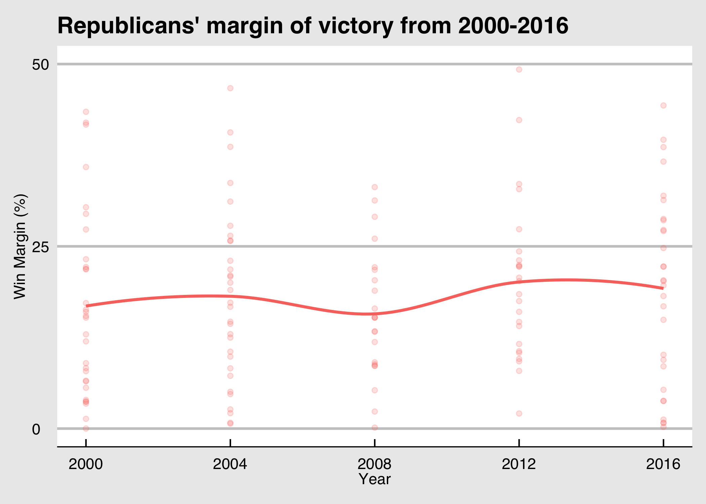
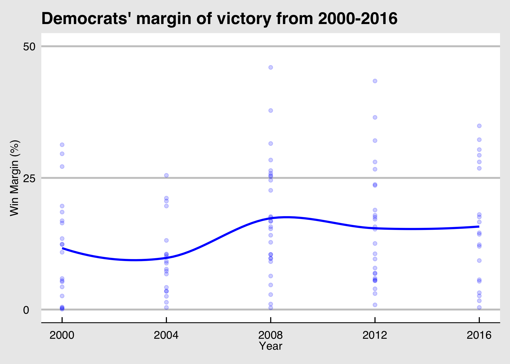
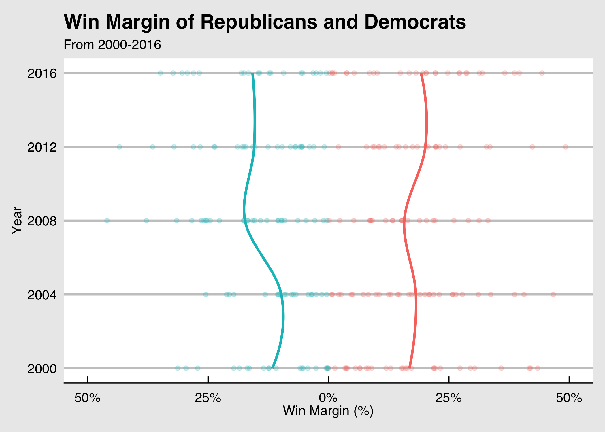

## 1347 Blog

### September 14, 2020

There has been (and is still) much discussion about the state of American politics. Since Donald Trump's election in 2016, this discussion has become increasingly 
intense as reports from [Pew](https://www.pewresearch.org/topics/political-polarization/) indicate that Americans are more polarized than last election cycle 
in regard to race and gender, while [Gallup](https://news.gallup.com/opinion/polling-matters/268982/impact-increased-political-polarization.aspx) addresses the 
challenges
of increased polarization and [the Atlantic](https://www.theatlantic.com/ideas/archive/2018/11/why-are-americans-so-geographically-polarized/575881/) attempts to 
discern just why we Americans are so polarized. I too am interested in this question, and decided to study it this week using data on the percentage of party vote
share in America. 

Using the data that we were given this week, I calculated the margin of victory for each party. I then plotted the margin for each state that the Republican party
won for the five election cycles since 2000. After I did this, I calculated the line of best fit to show trends between the elections as the share of the vote 
moved up or down. 

I did the same thing for states where Democrats won presidential elections and viewed the results. I found interesting trends, including a significant bump for
Democrats in the 2008 election that they seem to have maintained since Obama's first victory. 

Finally, I wanted to compare the discrepancy between the two parties and their vote share over time. I then created the below graphic which shows the average margin 
of victory of both Democrats and Republicans since 1976. Interestingly, while it appears that there is a bit of a larger discrepancy between the margins of victory
now as opposed to in 1976, the gap is not as large as I had expected considering that there has been such a discussion surrounding the polarization of America. 

### September 21, 2020
